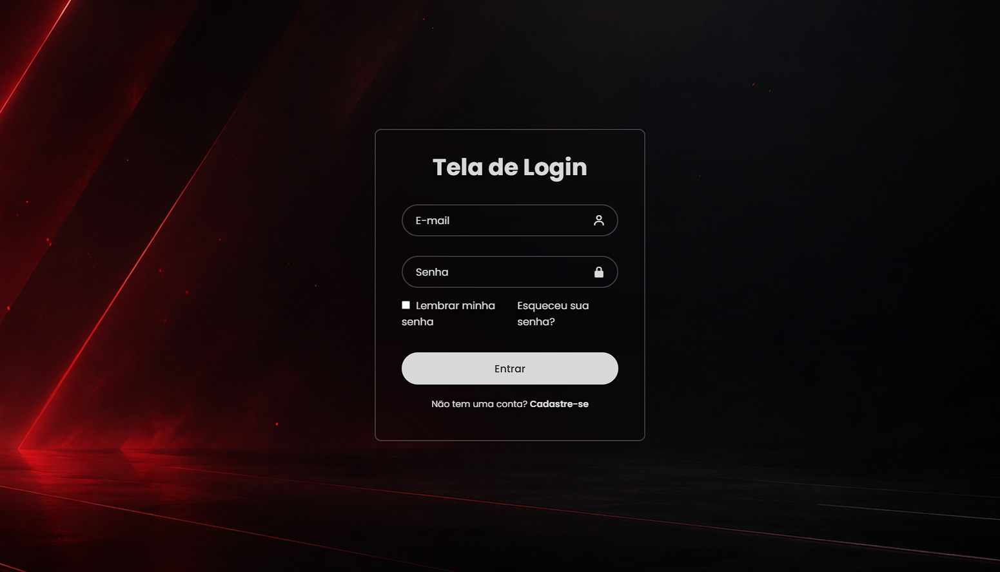

# Tela de Login

Uma tela de login desenvolvida durante meus estudos de HTML e CSS, com foco em estruturação de formulários e estilização de interfaces.

## Preview

## Tecnologias utilizadas

- HTML5
- CSS3
- Boxicons
- Google Fonts

 ## HTML

  - estrutura semântica básica;
  - `<main>`;
  - `<form>`;
  - `<input>`;
  - `<label>`;
  - `<button>`;
  - links com `<a>`;
  - atributos com `placeholder`, `type` e `class`.

## CSS

- Flexbox;
- posicionamento;
- `<border>`;
- `<border-radius>`;
- `<box-shadow>`;
- `<background-image>`;
- `<background-size>`;
- `<backdrop-filter`;
- pseudo-classes `:hover`;
- pseudo-elemento `::placeholder`;
- unidades `px`, `%` e `vh`;
- transparência `rgba()`;
- importação de fontes.

  ## Observações

  Este projeto foi desenvolvido com finalidade de estudo e demonstração de interface.

  A tela não possui sistema de autenticação ou cadastro funcional. Os campos, links e botão representam apenas a interface visual.
